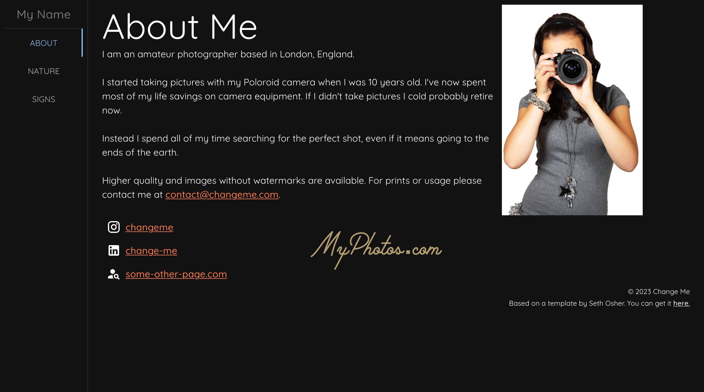

# NEXT.js Photography Portfolio Site
This is a photography portfolio site built with [NEXT.js](https://nextjs.org), 
[Material UI](https://mui.com), 
[react-photo-album](https://react-photo-album.com/), and
[yet-another-react-lightbox](https://yet-another-react-lightbox.com).

You can find a live sample of this template at [sophoto.uk](https://sophoto.uk).

They key features of this portfolio template are:
* Automatic generation of galleries from folders, images and a mdx description.  Just drop in an image or folder, and it will be added automatically in the next build.
* Image resizing at build time to take advantage of the browsers ability to load smaller images when a full size is not needed and to support NEXT.js static hosting. WebP files are produced similar to the live NEXT.js image optimisation.
* An about/contact page that can be customised.
* Attractive gallery pages with a descriptive caption and click to open a lightbox/carousel mode.
* Reactive sizing and layout that works well from mobile to desktop.   
* A dark theme that can be customised or disabled
* No code is required to add new images or galleries.



## Getting Started
To get started, clone this repository and install the dependencies 
```sh
npm install
```

To start the development server run
```sh
npm run dev
```

## Image resizing
In dev mode resized images will be created on the first visit to a gallery page.  
This can cause the first page load to appear slow, as it will wait until all the images are generated
before returning the page to ensure you don't see missing images.   
Subsequent visits will be faster as only missing resized images are generated

If not already performed in dev mode, images will be generated during the `npm run build` step.  
To avoid delays on first load in dev mode you can run the build first.  
If you have a very large set of photos this may be worth it.

Resizing and conversion to WebP is performed using [sharp](https://sharp.pixelplumbing.com/).

## Customising the Site
You need to make at the least the following changes:
- In `next.config.js` edit the site URL and title.  The title is displayed above the menu.  The URL is used for metadata, e.g. open graph previews and canonical links.
- In `pages/index.tsx` edit the site title, description, about content and meta data.
- Create your own custom icons and replace the ones in the `public/images/icon.png`.
- Replace the images in `public/images` with your own images (profile, logo etc.).
- Create your own gallery images and replace the ones in `public/images/gallery`.
- In each gallery create an `_index.mdx` file to describe the gallery content.  If you don't create an _index.mdx file the site tries its best using the folder name.  For SEO a proper set of metadata is recommended. 

## Deploying the Site
To deploy the site, run `npm run build` which will build and export the size including generating the resized images.
You can then deploy the site using any static site hosting service. 
For example, I use cloudflare pages to host my site.  

If you want to preview the built site, run `npm run build && npm run serve` which will serve the exported site locally from `/out`.

## Adding a New Gallery or New Images
To add a new gallery, create a new folder in `public/images/gallery` and add your images to it.
Then, create an `_index.mdx` file in the folder to describe the gallery content.

To add images you just need to drop them in the appropriate gallery folder.

## Customising the Theme
The theme is defined in `src/themes/Darktheme.tsx`. You can customise the theme by editing this file.
The fonts are loaded in `src/themes/fonts.ts` and used by the theme.
If you need more instructions on how to customise the theme, please refer to the [Material UI documentation](https://mui.com/material-ui/customization/theming/).

## Contents of the `_index.mdx` file
The `_index.mdx` file is used to describe the gallery content. It is written in markdown and can contain the following:
- `title` - the title of the gallery shown in the menu
- `description` - a description of the gallery used in meta tags (it should be longer and descriptive)
- `keywords` - a list of keywords used in meta tags
- `caption` - which is the header displayed on each gallery page
For example
```markdown
---
title: Gallery Title
description: A description of the gallery for metadata search engines
keywords: keyword1, keyword2, keyword3
caption: A caption for the gallery
---
The markdown section is currently unused.
```

## Open graph previews
If you want open graph previews, create them by taking screenshots (or using a tool) and
drop them in `public/open-graph/[path]`. The path should be the same as the gallery path.
The home page is `public/open-graph/about.png`.

There is a sample custom preview you can use at `/ogimage`.

## Contributions
If you have a suggested enhancement, feel free to submit a pull request.

## Attributions
Sample images from:
* https://www.photos-public-domain.com
* Eye icon from https://www.pngwing.com/en/free-png-hyliz
* Photographer: https://www.publicdomainpictures.net/en/view-image.php?image=4360&picture=female-photographer

## License
This project is licensed under the MIT License - see the [LICENSE](LICENSE) file for details.
Attribution is required.

Copyright (c) 2023 Seth Osher


